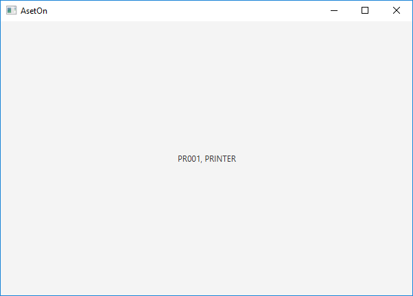

[](https://travis-ci.org/babeguru/AsetOn-Desktop)
[](https://opensource.org/licenses/MIT)
[](http://hits.dwyl.io/babeguru/AsetOn-Desktop)
[](https://www.patreon.com/babeguru)

# AsetOn-Desktop

>Asset Management System

## Untuk Mulai

>Clone repo ini [AsetOn-Desktop](https://github.com/babeguru/AsetOn-Desktop.git).
```
git clone https://github.com/babeguru/AsetOn-Desktop.git
```

## Lingkungan Pengembangan

>Dapat menggunakan Integrated Development Environment (IDE) dari Jetbrains yaitu [IntelliJ IDEA](https://www.jetbrains.com/idea/) Ultimate ataupun Community.

## Koneksi ke [AsetOn-API](https://aseton.herokuapp.com)

> Pertama, buat model data disesuaikan dengan entitas di API (contoh: Barang)
```
public class Barang {
    @SerializedName("idBarang")
    private Long idBarang;
    @SerializedName("kodeBarang")
    private String kodeBarang;
    @SerializedName("namaBarang")
    private String namaBarang;

// Contructor
// Getter & Setter
}
```

> Kedua, buat skema URI untuk memanggil entitas pada API
```
public interface BarangAPI {

    @GET("/api/barang/{id}")
    public Call<Barang> cekBarang(@Path("id") Long id);

    @GET("/api/barang/")
    public Call<Barang> ambilBarang();

}
```


> Ketiga, buat Service untuk mengkonversi objek ke json dan sebaliknya
```
public final class BarangService {

    private static BarangService dInstance;
    private static final String BASE_URL = "https://aseton.herokuapp.com/";
    private Retrofit dRetrofit;

    public BarangService() {
        HttpLoggingInterceptor interceptor = new HttpLoggingInterceptor();
        interceptor.setLevel(HttpLoggingInterceptor.Level.BODY);

        OkHttpClient.Builder client = new OkHttpClient.Builder()
                .addInterceptor(interceptor);

        dRetrofit = new Retrofit.Builder()
                .baseUrl(BASE_URL)
                .addConverterFactory(GsonConverterFactory.create())
                .client(client.build())
                .build();
    }

    public static BarangService getInstance() {
        if (dInstance == null) {
            dInstance = new BarangService();
        }
        return dInstance;
    }

    public BarangAPI barangAPI() {
        return dRetrofit.create(BarangAPI.class);
    }

}
```

> Keempat, buat controller FXML (JavaFX) untuk mengeksekusi API dan mengimpelementasi pada UI
```
public class FXMLController {
    @FXML
    private Label label;

    public void initialize() {
        BarangService.getInstance()
                .barangAPI()
                .cekBarang((long) 1)
                .enqueue(new Callback<Barang>() {
                    @Override
                    public void onResponse(Call<Barang> call, Response<Barang> response) {
                        Barang barang = response.body();
                        Platform.runLater(() -> {
                            label.setText(barang.getKodeBarang() + ", " + barang.getNamaBarang());
                        });
                    }

                    @Override
                    public void onFailure(Call<Barang> call, Throwable t) {
                        Platform.runLater(() -> {
                            label.setText("An error occured");
                        });
                        t.printStackTrace();
                    }
        });
    }
}
```

> Kelima, jalankan program untuk melihat hasilnya


